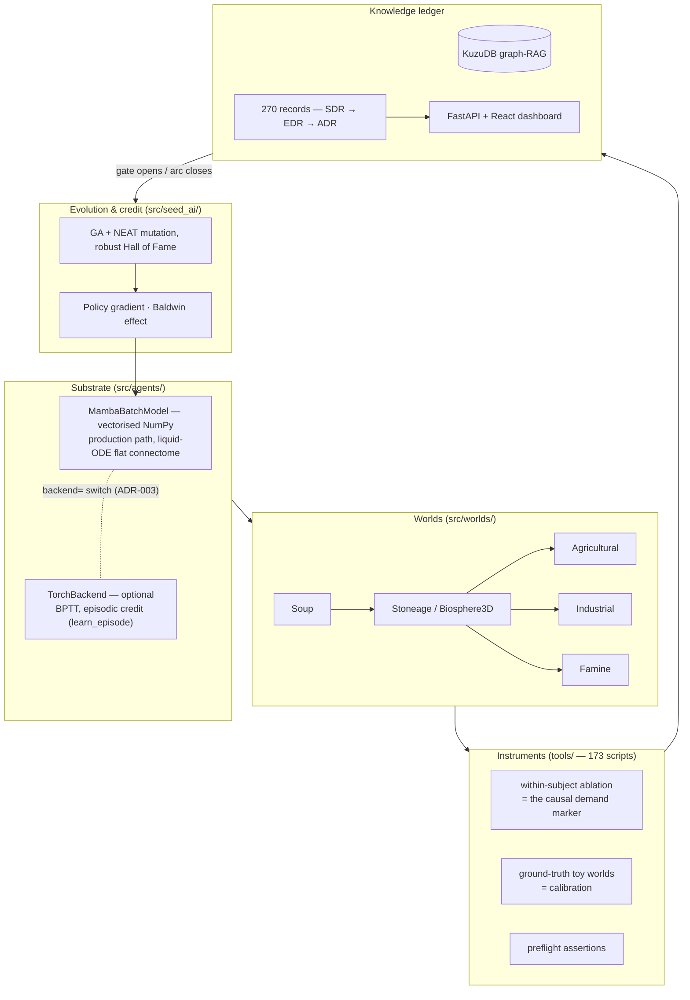

# AGAGI

[](https://github.com/RoJLD/AGAGI/actions/workflows/ci.yml)
[](LICENSE)
[](https://www.python.org/)
[](docs/EDR/)
[](tools/check_instrument_calibration.py)

> **"The good is not stated but found — and it is found only if the world DEMANDS it."**

AGAGI is an empirical research repository built around a single falsifiable question: **can a simulated
world make cognition worth having?** Agents live in continuous-time multi-agent worlds under selection.
Nobody hand-codes planning, language, or cooperation. Either the environment's demand selects for them,
or it does not — and this repository records which, run by run, including every time the answer was no.

The scientific output is not a model checkpoint. It is a **verified graph of 270 decision records**, where
refutations, null results, and self-corrections carry the same weight as successes.

---

## At a glance

| Dimension | Measured on `main`, 2026-07-29 |
| --- | --- |
| **Decision records** | 279 in the graph, of which 258 EDR, plus gate specs, ADRs and method references — link-checked, orphans ratcheted |
| **Measurement instruments** | 97 detected, 28 calibrated against ground truth, 0 new uncalibrated (ratcheted) |
| **Error classes** | 18 catalogued, **every one now carrying a guard**: executable, documented, or explicitly not automatable |
| **Sealed pre-registrations** | 7 — analysis rules fixed before the run, corrections kept visible |
| **Code** | ~62k lines of Python (`src/` `tools/` `tests/` `backend/`) · 173 analysis tools · 1310 tests |
| **Dashboard** | FastAPI backend + React 18 / Vite frontend, OpenAPI-typed, Playwright E2E |
| **Core dependency** | NumPy. PyTorch is optional (`requirements-torch.txt`) |
| **License** | MIT |

Numbers above are produced by the repository's own checkers, not by hand — and they drift as research
lands, so the date matters. Reproduce them on any checkout:

```bash
python tools/check_record_links.py --report          # records, orphans, id collisions
python tools/check_instrument_calibration.py --report # instruments detected vs calibrated
python -m pytest --collect-only -q | tail -1          # test count
```

---

## What makes this repository unusual

Most simulation repositories publish the runs that worked. This one publishes the apparatus that decides
whether a run means anything at all — because that apparatus was built out of measured failures.

The founding measurement: over one research arc (`WARM-005` → `WARM-009`), **7 adversarial reviews found
7 real errors**. Not stylistic ones — a memory-aliasing bug, a control that could not fail, an inferred
causal link that measured null, a regression check that selected zero tests. None would have been caught
by careful writing.

The lesson that organises the whole repository:

> **An uncalibrated instrument does not merely fail — it PRODUCES a result.**
> The `EDR-WARM-007` aliasing bug generated a dose-response curve, correlations, and a coherent negative
> control. All mutually consistent. All artefacts. They survived a full review pass.

So every rule here is executable. Four ratchets enforce them.

### 1. Experimental preflight — four error generators, two of them assertable

`tools/experiment_preflight.py` ([reference](docs/REF/REF-EXPERIMENT-PREFLIGHT.md)). Before any expensive
run, four questions must be answered, and each executable assertion cites the concrete error it would have
caught:

| Question | Assertions |
| --- | --- |
| **A.** Can the instrument produce *both* outcomes? | `assert_ablation_changes_something`, `assert_positive_control`, `assert_not_degenerate`, `assert_selection_nonempty` |
| **B.** What is the unit of replication? (here: the *era/seed*, never the agent) | `declare_design` |
| **C.** Is the measured quantity the one that acts? | `assert_no_aliasing`, `assert_predictor_measured_in_situ` |
| **D.** Am I reasoning instead of measuring? | `declare_design(links={...: "inferred"})` raises a warning |

A negative control that cannot fail is not a control. The informative control is the **inverse**
manipulation.

### 2. Instrument calibration ratchet — the dominant deficit, now bounded

An *instrument* is any function producing a scientific claim: a verdict, a ratio, a survival figure, a
rate. `tools/check_instrument_calibration.py` scans `tools/` and `src/seed_ai/` for them and requires each
new one to be validated against a **known answer** — a toy world from `tools/ground_truth_worlds.py`.

Three admissible forms of test: **exact no-op** (specificity) · **prediction** (linearity in an imposed
dose) · **monotonicity** (direction). Calibrating by *prediction* beats calibrating by absolute value:
identify nuisances at one operating point, predict at another.

Legacy debt is frozen in a baseline. **No new uncalibrated instrument can enter the repository.** The
ratchet has itself been caught lying twice, and both holes were closed with permanent regressions —
matching by name substring instead of `(function, branch)`, and scanning only `tools/` while a foundational
instrument lived in `src/seed_ai/`.

### 3. Error registry — every review finding becomes a guard

[`docs/REF/REGISTRE_ERREURS.md`](docs/REF/REGISTRE_ERREURS.md) catalogues 16 error classes. Each carries a
guard status: `executable`, `documented`, or `not automatable`. An error recurring twice as `documented`
must be promoted or reclassified. There is no third time.

The registry exists because the same class recurred **three times** in a single arc — generalising from a
salient sample — including once inside the record that denounced it. Two entries are deliberately honest
about their limits:

- **E9** (generalising from a salient sample) is marked **not automatable**. No code detects it. This is
  what makes adversarial review an obligation rather than a comfort.
- **E14** (an executable guard is never applied retroactively) has a **partial** guard, and the partiality
  is a result. Distinguishing "ran a positive control" from "cites a positive control run elsewhere"
  requires understanding the sentence, not matching it. Both calibration failures are frozen as regressions.

### 4. Record graph hygiene — no orphan conclusions

Every conclusion destined for the knowledge graph must attach to a gate (`gate: G0…G4` or `foundational`),
test a hypothesis (`tests: [SDR-Gx]`), or be adopted by a reference note. `tools/check_record_links.py`
enforces it; `tools/consolidate_records.py` builds the graph and fails on a broken link.

A `pre-commit` hook (`tools/hooks/pre-commit`) runs the records check and the calibration check
independently, each scoped to its own staged files. **Both are blocking.** Legacy debt — 42 orphans,
8 id collisions inherited from parallel-session numbering — is frozen in a baseline; only new violations
fail.

---

## The research programme: five gates

Bottom-up by dependency. A gate opens only once the previous one has been *measured*. Negative results are
deliverables.

| Gate | Question | KPI | Status |
| --- | --- | --- | --- |
| **G0** | Does the world demand anything? | `survival_ratio(champion/dummy)` | **validated** — stoneage demands (3.74–4.67×, Cliff δ=+0.92, Holm p=0.003); famine too |
| **G1** ★ | Does competence generalise? *(north-star)* | `transfer_ratio` | open — first measurement NEUTRAL under power (n=8, median 1.026, sign_p 1.0) |
| **G2** | Does the agent compose? | emergence of an unrewarded chain | open |
| **G3** | Does language pay? | `mammoth_kills` ON/OFF | open in-world; **closed in proxy** — language pays iff the task forces resolving an information asymmetry (5–7×) |
| **G4** | Does the agent anticipate? | `anticipation_bench` | open — a linear transition model is NEUTRAL on rich observations; the bilinear form is the live lead |

Specifications live in [`docs/SDR/`](docs/SDR/); the strategy that connects them is
[`docs/roadmap/FIL_DIRECTEUR_AGI.md`](docs/roadmap/FIL_DIRECTEUR_AGI.md).

---

## What we have learned (and what we got wrong)

### Offline, the lock is credit; in-world, it is not

Territory by territory, the offline records converge on one diagnosis: **the substrate REPRESENTS what is
needed but does not CONVERT representation into behaviour.**

| Territory | The representation is there | …the behaviour fails | The lever |
| --- | --- | --- | --- |
| Navigation | H decodes direction at 0.81 | emitted == correct at 0.03 | dense per-step signal recovers the readout |
| Cognitive heads | heads decodable from the shared trunk | disjoint heads do not help *by architecture* | credit on the trunk, not the readouts |
| Means-ends binding | `did_x` decodable from H (AUC 0.90) | outcome ⊥ `did_x` | gate + episodic credit |
| Craft | tier-2 reached | never re-crafted | retention is policy-locked; no world-side lever |

That diagnosis held for a year and drove the migration to differentiable credit. **In-world, it has now
been tested and it does not hold** — see below. Decodable-from-H and causally-used-by-the-policy turn out
to be different properties, and the in-world policy fails the second one.

### The in-world frontier: the lock is DISCOVERY, and it is not yet transferable

The dominant gap in this repository is that capabilities appearing cleanly in toy proxies vanish in the
biosphere. The `EVO` arc attacked it by elimination, changing one thing at a time:

| What was manipulated | Record | Outcome |
| --- | --- | --- |
| nothing — survival alone | `EVO-004` | the policy reads **nothing**: saliency at the floor on every channel (median ≈ 0.004) against 0.99 for a synthetic reader |
| the **weight** of a cognitive objective | `EVO-005` | the population climbs to the ceiling of what is winnable *without* reading, and no further |
| the **granularity** of the objective (partial credit) | `EVO-007` | **0/12**, at matched subtask difficulty — identical to no partial credit at all |
| the **variation operator** | `EVO-009` | **12/12** readers, Fisher p = 9.6 × 10⁻⁶, at no survival cost |

The pivot is `EVO-008`. Tracing the one lineage that ever produced a reader shows saliency going from
`0.00` to `1.00` **in a single era**, with no intermediate value in any era of any seed — a discrete event,
not a gradient — and then holding for 28 eras out of 29. The objective already does half the work: it
**retains** reading as soon as reading exists. What it cannot do is **create** it. Partial credit was
built to climb a gradient that is not there; you do not make a dice roll more frequent by smoothing the
reward.

**This is a diagnosis, not a solution, and the follow-up says so.** `EVO-009`'s bias uses knowledge of
which edges matter — information no real problem provides. `EVO-010` tested the obvious agnostic
substitute and refuted it: **254,117 random weight wakeups bought zero readers.** Worse for the tidy
story, it measured that creating the edge is not sufficient — **4 champions out of 4 carry the reader edge
and none of them reads.** The appealing explanation that followed (the output must be dominated by a
single channel) was itself tested: pruning competitors recovers **8%** of the effect, specific but tiny.

So the honest position today: the in-world lock is localised to the variation operator's ability to
*produce* the wiring, **targeting** rather than volume — and what distinguishes a reader from a mere
edge-carrier is **not established**. `EVO-010` closes a road without opening one.

### Self-refutations, recorded in full

The repository grades itself by how it handles being wrong:

- **`EDR-EVO-007` retracts `EDR-EVO-006`, one day later.** "Partial credit is the missing gradient" rested
  on three subtasks of unequal difficulty — the one that got learned was a sign threshold, the one that
  failed required winning an 8-way argmax. At matched difficulty the arm *with* partial credit produced
  exactly as many readers as the arm without: **zero out of twelve**. Both candidate explanations fell
  together. The reading rule had been **sealed before the run** (`tools/preregister.py`, the first use of
  the E11 guard), with the explicit commitment that `EVO-006` would fall if both arms failed. The initial
  threshold then proved inadequate mid-run, and the guard forced correcting it **visibly** — all three
  sealed files kept — rather than silently.
- **`EDR-DREAM-001` refutes `EDR-095`.** "Forced dreaming causally reduces survival by 40–46%" reproduced
  exactly — and was a **birth-flood artefact**. Forced dreaming multiplies the living population by 13–16×;
  most members are born late, so median age falls mechanically. On a birth-matched founder cohort the
  effect is absent, and the sign inverts (+77%, 15/20, wilcoxon_p 0.0085). The clue — `n_lived` ×16 — had
  been published *inside the original record*, filed as a side effect. New error class **E15**: no bound
  guard can see this; no arm is at floor or ceiling.
- **`EDR-WARM-010` refutes `EDR-WARM-002`.** "The fitness landscape is flat" rested on a ratio read from an
  arm living 5.0–7.2 ticks — **below** the measured blind floor of 9.0. The positive control that would
  have caught it cost **6 seconds** and had never been run. The landscape is not flat: a graded-competence
  oracle yields 9.0 → 12.0 → 17.5 → 37.0 → 94.2 → 200.0, strictly monotone.
- **`EDR-AUDIT-001`.** A retro-audit of null verdicts found the common mechanical cause: `ablation_verdict`
  was a bare ratio of medians with no bound guard — it **produced** the null instead of measuring it.
  The guard is now armed by default.
- **A cross-cutting alert was retracted.** "12 agents are not independent replicates" was withdrawn after
  reading how `n` is actually constituted: the benches aggregate `median(ages)` to one value per era.
  A 2-minute check prevented a useless audit.

Because records publish **absolute values** and not only ratios, `EDR-095` could be re-run after an
instrument fix and shown to still hold on its own arms (0.547 vs 0.543 published). That is the most concrete
argument in the repository for publishing raw numbers.

---

## Architecture



**Substrate.** The production path is a vectorised NumPy population model — a flat continuous connectome
with excitability thresholds, contextual neuromodulation and QKV attention, propagated for the whole
population at once. A PyTorch backend (`ADR-003`) is an optional swap enabling backpropagation through time
and episodic credit assignment; it is off by default (`use_torch_inworld = False`).

**Search.** Genetic algorithm over topology and weights, plus intra-life gradient, plus Baldwinian coupling
— evolution selects the initialisations that learn fastest. `ADR-002` records the `preserve_dims` fix, whose
absence had silently flattened every evolved architecture.

**Instruments.** The repository's central methodological result is that the sound marker for "capability X
is demanded" is a **within-subject ablation of X on the same subject** — not "an agent equipped with X
survives", which false-positives. Validated against ground truth across four modalities: perception,
communication, generalisation, memory. See [`REF-DEMAND-MARKER`](docs/REF/REF-DEMAND-MARKER.md).

**Resource leases.** Two concurrent world probes fight over the KuzuDB lock and silently contaminate each
other's measurements. `tools/jobs/` makes that impossible rather than discouraged: named exclusive
resources, TTL + heartbeat + PID identity for crash recovery, and process-tree kill on timeout.

---

## Repository layout

| Path | Contents |
| --- | --- |
| [`src/agents/`](src/agents/) | Neural substrate: `mamba_agent.py`, `backend_torch.py`, `world_model.py`, `planner.py` |
| [`src/seed_ai/`](src/seed_ai/) | Evolution, NEAT mutation, robust Hall of Fame, policy gradient, referential head |
| [`src/worlds/`](src/worlds/) | Progressive ecologies: soup → stoneage → agricultural / industrial / famine |
| [`src/graph_rag/`](src/graph_rag/) | KuzuDB knowledge graph, async logger, adaptive tuner, LangGraph supervisor |
| [`src/metaprog/`](src/metaprog/) | Self-modification: bytecode compiler, AST sandbox |
| [`tools/`](tools/) | 173 probes, ablations and checkers — **plus the four ratchets** |
| [`tools/jobs/`](tools/jobs/) | Named exclusive resource leases, governed runs, doctor |
| [`docs/EDR/`](docs/EDR/) | 249 experiment decision records — the granular evidence |
| [`docs/SDR/`](docs/SDR/) | 5 gate specifications (G0→G4) |
| [`docs/ADR/`](docs/ADR/) | 3 architecture decision records |
| [`docs/REF/`](docs/REF/) | Method references + the [error registry](docs/REF/REGISTRE_ERREURS.md) |
| [`docs/roadmap/`](docs/roadmap/) | [Actionable backlog](docs/roadmap/PRIORITES_ET_DETTES.md), strategy, per-domain roadmaps |
| [`backend/`](backend/) · [`frontend/`](frontend/) | FastAPI API + React dashboard over runs, records and energy traces |

> **Language note.** Code, tests and this README are in English. The 270 research records, the roadmap and
> the error registry are written in **French** — they are a working laboratory notebook, and translating
> them retroactively would risk altering measured claims. Record titles and verdict constants are in
> English, so the graph is navigable without French.

---

## Quickstart

### Install

```bash
git clone https://github.com/RoJLD/AGAGI.git && cd AGAGI
pip install -r requirements.txt          # NumPy core — enough for most probes
pip install -r requirements-torch.txt    # optional: torch backend (BPTT, episodic credit)
```

Python 3.13 is what CI uses.

### Run a simulation

```bash
HEADLESS=1 EXPERIMENT_SEED=2026 MAX_ERAS=30 python main_biosphere.py
```

| Variable | Default | Meaning |
| --- | --- | --- |
| `WORLD_TYPE` | `stoneage` | `soup` · `stoneage` · `agricultural` · `industrial` · `famine` |
| `HEADLESS` | `0` | `1` disables console rendering — required for throughput |
| `EXPERIMENT_SEED` | — | global seed; set it for strict reproducibility |
| `MAX_ERAS` | `30` | number of evolutionary eras |
| `MUTATION_RATE` | `0.05` | per-gene mutation rate |

⚠️ Stop the `memory_retriever` and disable KuzuDB before simulation loops. Ambient graph memory makes runs
non-reproducible and contends on the database lock. Wrap any world simulation in a lease:

```python
from tools.jobs.run import hold, run

with hold("kuzu", owner="my-probe"):
    ...
run("my-run", cmd, resources=["kuzu"], timeout_s=3600)   # timeout kills the process TREE

# python -m tools.jobs.doctor    → lease and process state (read-only by default)
```

### Run the dashboard

```bash
docker compose up -d          # backend :8000, frontend :4173
curl --fail http://localhost:8000/health
```

### Verify the apparatus

```bash
pytest -m "not slow"                             # fast suite (~13 min; per-test timeout 120 s)
python tools/experiment_preflight.py             # the four error generators
python tools/check_instrument_calibration.py     # calibration ratchet
python tools/check_record_links.py --report      # record graph hygiene
python tools/consolidate_records.py              # rebuild the graph, fail on broken links
make e2e                                         # Playwright E2E against docker compose
```

---

## How to read a record

Every record carries YAML frontmatter that places it in the graph:

```yaml
---
id: EDR-DREAM-001
type: EDR
status: active
gate: G0                                    # or foundational
tests: [SDR-G0]                             # which hypothesis it tests
adopts: [REF-EXPERIMENT-PREFLIGHT]          # which method it applies
corrects: [EDR-095]                         # what it overturns
verdict: SOME_UPPERCASE_CONSTANT
---
```

The body states the question, the method (with the exact tool and its parameters), the measurement with
**absolute values**, and — mandatory — the caveats and the scope beyond which the conclusion does not
travel. Records that refute earlier records declare it in `corrects:`, and the superseded record keeps its
file. Nothing is deleted.

Good entry points: [`EDR-S2-012`](docs/EDR/S2-012_Champion_Body_Foundational_Verdict_Finally_Recorded_With_Its_Four_Weaknesses.md)
(a foundational verdict recorded together with its four weaknesses) and
[`EDR-DREAM-001`](docs/EDR/DREAM-001_Forced_Dreaming_Harm_Is_A_Birth_Flood_Artifact_Effect_Absent_On_Matched_Cohort.md)
(a clean self-refutation).

---

## On AI-assisted development

This repository is developed with heavy AI assistance — **228 design documents** under
[`docs/superpowers/`](docs/superpowers/) (117 specs, 111 execution plans), agent-run adversarial reviews,
and a [`CLAUDE.md`](CLAUDE.md) that encodes the experimental protocol as standing instructions.

That corpus is committed, not summarised: each spec states what was going to be built and why, and its
paired plan states what was actually done. Read alongside the records they produced, the two form an
auditable trail from intent to measured verdict — including the passes that ended in a refutation.

That is stated up front because it explains the guardrails rather than excusing them. Every ratchet
described above was built in response to a **measured** agent failure mode:

| Failure mode | Guard it produced |
| --- | --- |
| Produced a coherent dose-response curve from an aliasing bug | calibration ratchet + `assert_no_aliasing` |
| Called a control "verified" after checking two correct but irrelevant hypotheses | executable preflight assertions |
| Generalised from `agents[0]`, three times, once inside the record denouncing it | error registry E9, marked **not automatable** — hence mandatory review |
| Inferred a causal link to save 7 hours of compute; it measured null in 28 minutes | `declare_design(links={...: "inferred"})` |
| Documented a rule and then violated it the same day, three times, by three different actors | **every rule here is an executable check or a blocking hook** |
| Wrote a probe that reseeded the global RNG between eras, silently re-running a *different* lineage than the one under observation — and returned a flat curve that read as a finding | RNG save/restore with two frozen tests; the artefact was caught only because a **known-answer case** was in the design |
| Chose the analysis threshold after seeing the data | E11 guard — `tools/preregister.py` seals the rule before the run and refuses to rewrite it under a used name |

The transferable principle: **a documented rule without executable enforcement will be violated.** Prose
does not resist conviction; an assertion does.

---

## Status and limitations

Honest accounting, since the same standard applies to the README:

- **G0 is the only validated gate.** G1–G4 are open. The north-star — zero-shot transfer — measured
  NEUTRAL under power on its first attempt, and that null stands.
- **The in-world mechanism is unexplained.** `EVO-009` localises the lock to the variation operator, but
  with a bias that knows the answer. The agnostic substitute was tested and refuted (`EVO-010`), and what
  separates a reader from a genome merely carrying the reader edge is not established. This is the live
  frontier, and it is a narrow one.
- **69 of 97 instruments remain uncalibrated.** The debt is frozen and cannot grow, but it exists.
- **42 orphan records and 8 id collisions** are inherited from an earlier numbering scheme used across
  parallel sessions. Frozen in a baseline, de-orphaned in waves.
- **Runs are expensive and cost scales with success** — as survival rises, episodes lengthen and everything
  slows. Three long runs have been abandoned (8 h, 4 h projected, 89 min). Bound the cost in the design.
- **Research records are in French.**

The actionable backlog, with evidence and cost per item, is
[`docs/roadmap/PRIORITES_ET_DETTES.md`](docs/roadmap/PRIORITES_ET_DETTES.md).

---

## Contributing

Read [CONTRIBUTING.md](CONTRIBUTING.md) first. The short version: one experimental variable at a time,
preflight before expensive runs, calibrate any new instrument, attach every conclusion to the record graph,
and file every review finding in the error registry. Negative results are welcome — they are the point.

## License

MIT — see [LICENSE](LICENSE).

## Citation

```bibtex
@software{agagi,
  title  = {AGAGI: an empirical study of whether simulated worlds demand cognition},
  author = {Denis, Robin and contributors},
  year   = {2026},
  url    = {https://github.com/RoJLD/AGAGI},
  note   = {Decision-record-driven research repository, MIT licensed}
}
```
