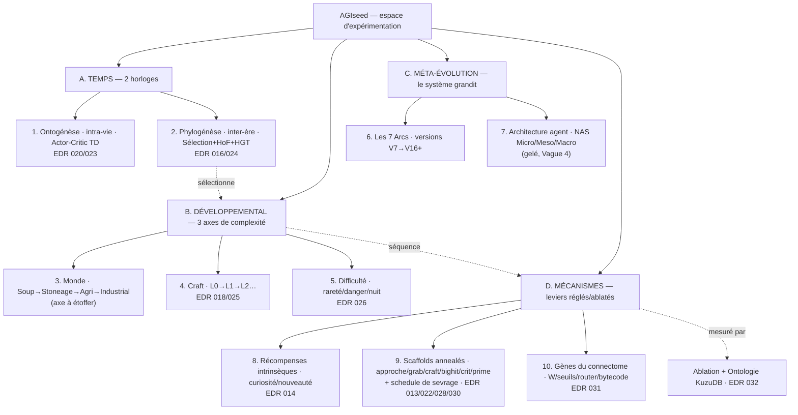

# Roadmap AGIseed : De l'Atome a la Civilisation

---

## Arbre Genealogique des Versions

```
V7 → V8 → V9_Mamba → V10_Language → V11_OpenEnded → V12_Metacognition
                                                         |
                                        V13_Cailloux → V14_Balistique → V15_Crafting_Feu (ACTIF)
                                                                             |
                                                                    V16_Language_Inventaire
```

## Architecture V15/V16 (Actuelle)

- **45 Entrées** : Lidar 6D, Position, Proie, Altar, Social, Langue, Prey Type, Surprise, Worm, Throw Feedback + Propriétés Physiques Objets (Poids, Tranchant, Friction, Comestibilité, Inflammabilité).
- **25 Sorties** : Mouvement 6D, Cognitif, Saut/Baisse, Grab, Throw, Rub (Crafting), Social 3, Visee 3D, Parole
- **Moteur** : Liquid Mamba BatchModel (Vectorisé) + TTC Adaptatif
- **Ecologie** : 9 proies + 5 vers de terre, proportionnelle, Feu, Crafting

---

## Les 7 Arcs de l'Evolution

| Arc | Theme | Experiences | Statut |
|---|---|---|---|
| 1 | **L'Animal** (Survie) | EXP 1-4 | TERMINÉ |
| 2 | **Le Primate** (Outils) | EXP 5-8 | TERMINÉ (V14) |
| 3 | **L'Homo Habilis** (Crafting) | EXP 9-12 | EN COURS (V15) |
| 4 | **L'Homo Sapiens** (Langage) | EXP 13-16 | EN COURS — code référentiel fiable câblé (`072-074`) ; bénéfice fonctionnel pas clos (`082`, manque la *sélection de l'usage*) |
| 5 | **La Tribu** (Culture) | EXP 17-20 | A VENIR |
| 6 | **Le Penseur** (Raisonnement) | EXP 21-24 | A VENIR |
| 7 | **La Conscience** (Graal) | EXP 25-30 | A VENIR |

Voir `roadmap_experimentation.md` (artifact) pour le detail complet.

---

## L'Axe Ontogénétique — Curriculum Développemental (2ᵉ Échelle de Temps)

> **Deux axes du temps, orthogonaux.** Les 7 Arcs décrivent la *phylogénèse* (ce que le **système** gagne, version après version). Cette section décrit l'*ontogénèse* : ce qu'un **cerveau individuel** doit maîtriser, et dans quel ordre, avant de changer de monde. On simule alors les deux axes du vivant — et *« l'ontogénèse récapitule la phylogénèse »* devient un principe de design, pas une métaphore.

| Axe | Échelle | Mécanisme | Granularité |
|---|---|---|---|
| **Phylogénèse** (les Arcs) | Inter-ères, V7→V16+ | Sélection, Hall of Fame, HGT | La population |
| **Ontogénèse** (ce curriculum) | Inter-mondes, soup→industrial | Maîtrise + transfert du connectome | L'individu |

> **État actuel** : les worlds ne sont *pas* chaînés — on tourne 30 ères dans un seul monde (`WORLD_TYPE`). Mais le transfert de cerveau existe déjà (import KuzuDB + neuro-chirurgie de redimensionnement, `IMPORT_AGENT_ID` / `KEEP_MEMORY`). Ce curriculum transforme ces briques isolées en **pipeline développemental**.

### 1. L'Échelle de Développement

Le cerveau ne repart pas *tabula rasa* à chaque monde : il est porté en avant, et la complexité monte avec sa compétence — comme un bébé qui franchit les stades de Piaget. Cette échelle de **compétences** est distincte de la timeline d'**expérience**.

| Monde | Stade (analogie) | Compétences à « maxxer » | KPI de maîtrise |
|---|---|---|---|
| **0 — Soup** | Sensorimoteur / réflexes | Homéostasie, approche/évitement | Survie médiane, énergie stable |
| **1 — Stoneage** | Causalité / objet | Usage d'outils, permanence de l'objet | Taux d'usage d'outils, crafting |
| **2 — Agricultural** | Planification | Gratification différée (semer→récolter), gestion de ressources | Horizon de planification, stock |
| **3 — Industrial** | Abstraction / composition | Division du travail, composition d'outils | Coopération, chaînes de production |
| **Gym cognitif** | Opérations formelles | Logique, calcul, jeux (cf. § 4) | Taux de résolution de puzzle |

### 1bis. Deuxième axe développemental : la complexité du craft (orthogonal)

Le développement ne se fait pas que le long des **mondes** (écologie) mais aussi le long de la **mécanique** des compétences. Leçon de l'EDR 017 : la chaîne de craft empile trop de gates *d'un coup* → inémergeable. D'où un **2ᵉ axe orthogonal** : on complexifie la mécanique **par paliers**, un gate à la fois, chacun maîtrisé avant le suivant.

| Niveau craft | Mécanique | Gate ajouté |
|---|---|---|
| **L0** | auto-craft (tenir tranchant+manche → lance, sans action) | collecter 2 ingrédients |
| **L1** | + action de craft (`rub`) | le geste |
| **L2** | + recette positionnelle (inventaire 0,1) | l'ordre |
| **L3+** | recettes multi-étapes (rock→sharp_rock→spear) | la composition |
| **LN** *(très loin)* | craft **3D** : forces, orientation, sens | la physique de l'outil |

L'agent vit donc dans un **espace développemental 2D** : `Monde × Craft`. Le curriculum rampe `craft_level` par maîtrise (taux de craft), via les mêmes mastery gates (§2). Détail : `docs/EDR/018` ; rendu possible par le fix du moteur évolutif (`docs/EDR/016`).

### 2. Mécanisme de Graduation (Mastery Gates)

*   **Métriques de compétence** : au-delà de l'énergie (seule récompense actuelle, `fitness = energy*0.5 + age*0.1`), un *bulletin de notes* par monde — KPI spécifiques au skill, ingérés par l'`AdaptiveTuner`.
*   **Critère de graduation = détection de plateau** : quand la compétence médiane plafonne sur K ères consécutives, la population « diplôme ». Ici, la stagnation est un signal de **promotion**, pas d'échec — c'est l'« Observateur de Famine Cognitive » (§ 2.1.A) réorienté.
*   **Protocole de transfert** : import neuro-chirurgical du connectome + carry-over de la mémoire NTM (déjà implémenté).
*   **Politique de progression** : linéaire (0→1→2→3) / adaptative (le Supervisor choisit le monde où la compétence manque) / branchante (des espèces qui se spécialisent — lien co-évolution des architectures, § 2 des Améliorations Futures).
*   **⚠️ Tension à tester** : « maxxer les stats » peut *entrener* (overfitting aux quirks d'un monde) et **ralentir** le transfert. Parfois « assez bon puis on avance » transfère mieux. Le seuil de graduation devient une **variable d'expérience** (Commandement 15).

### 3. Le Relicat de Cerveau (Persistance & Croissance)

*   **Un cerveau qui grandit** : le connectome + NTM persistant traverse les mondes et **ajoute des neurones** quand un monde ajoute des entrées/sorties (neuro-chirurgie + mutations `add_node`). C'est l'enjeu du **Connectome Élastique** (Solution 2).
*   **Anti-oubli catastrophique** : trois parades biologiquement fondées —
    *   *Périodes critiques* : on gèle les sous-réseaux précoces (un bébé ne réapprend pas à téter).
    *   *Rehearsal interleaved* : les mondes anciens sont rejoués périodiquement, comme des rêves.
    *   *Réseaux progressifs* : on ajoute des modules neufs, on gèle les anciens.

### 4. Le Gym Cognitif (Jeux Abstraits)

Des environnements d'intelligence pure — **portes logiques, calcul, échecs, Go** — décorrélés de la survie, pour pressuriser des capacités que la survie seule ne fait pas émerger (survivre n'exige pas de faire des maths). Trois statuts possibles, non exclusifs :

*   **(A) Embarqué** : le puzzle est un artefact dans le monde (l'entrée *Altar* existe déjà) ; le résoudre donne de l'énergie. Préserve le *grounding*.
*   **(B) Rêvé** : l'infra MCTS/Dreaming time-share le connectome ; la nuit, l'agent joue des parties « dans sa tête ». Lien direct avec l'axe Dreaming & MCTS.
*   **(C) Gym séparé** : de nouveaux `BaseWorld` symboliques (cycle de vie victoire/défaite à redéfinir — pas d'énergie ni de mort).
*   **Cas spécial — portes logiques** : banc d'essai naturel du `ntm_compiler.py` (Self-Wiring). Le connectome peut-il *devenir* un AND/XOR puis les composer ? Cela ferme une boucle avec du code déjà écrit.
*   **⚠️ Tension** : du symbolique pur risque un *savant désincarné* (symbol grounding) — d'où un usage en **accélérateur/benchmark** dans le curriculum, jamais en substrat primaire.

### 5. Récompense Scaffold (« Cheatcode ») — Piste à Tester *contre* le Pur Intrinsèque

L'axe 4.1 (récompenses pur intrinsèques, *« pas dit mais trouvé »*) reste l'**idéal manifeste**. Cette sous-section décrit une **voie pragmatique alternative**, à confronter expérimentalement à 4.1 (Commandement 15 : 1 variable, valide ou revert) — pas à le remplacer.

*   **Hypothèse** : injecter une récompense explicite forte *tôt* amorce un comportement, puis on la **fait décroître** (annealing) jusqu'à ce que l'intrinsèque prenne le relais. Des roues stabilisatrices, retirées une fois l'équilibre acquis.
*   **Shaping de Skinner** : dense tôt, sparse tard — `tools/skinner_box.py` existe déjà ; une micro-récompense +0.5 (alignement vocal) est déjà en place.
*   **Impulsion = pic phasique** : récompenser *l'acte d'apprendre* (un rollout MCTS qui a bien prédit, un HGT réussi, une formation de concept) plutôt que le seul résultat externe — une dopamine de l'insight.
*   **Reframe** : dans le vivant, l'évolution EST le cheatcode (le circuit dopaminergique inné est un *prior compressé*, pas de la triche). Variante extrême : faire **évoluer la fonction de récompense** comme un gène (lien § 4.3, méta-méta-programmation) — le cheatcode n'étant alors que la graine initiale de ce gène.
*   **Verdict attendu** : le Sociologue tranche. Si le scaffold bat le pur intrinsèque en *vitesse* sans dégrader robustesse/généralisation, on l'adopte ; sinon, revert vers 4.1.

---

## 🗺️ Dimensions d'Expérimentation (carte de référence)

Toute expérience du projet se situe dans **4 familles** de dimensions orthogonales. On *maîtrise* aujourd'hui B et D ; on a *réparé* A ; C reste la frontière.



| Famille | Axes | Instrument | Statut |
|---|---|---|---|
| **A. Temps** | Ontogénèse, Phylogénèse | apprentissage TD / sélection HoF | ✅ réparé (`016/020/023/024`) |
| **B. Développemental** | Monde, Craft, Difficulté | `CurriculumRunner`, drivers 2D | ✅ Craft+Difficulté ; Monde à étoffer (`025/026/027`) |
| **C. Méta-évolution** | Arcs, NAS architecture | metaprog / sandbox (RSI) | ⏳ frontière (gelé Vague 4) |
| **D. Mécanismes** | intrinsèques, scaffolds, gènes | **ablation + ontologie** | ✅ instrument livré (`031/032`) |

> **Lecture clé :** l'ablation (D) mesure *« utile à l'expert ? »* ; le curriculum (B) répond *« utile à l'émergence ? »* — deux questions distinctes (`EDR 032`). La frontière est **C** : on n'a pas encore d'instrument pour faire *grandir l'architecture* (NAS) ni exploiter la *phylogénèse longue*.

---

## Commandement 15 — Loi du Sociologue

> Chaque innovation = 1 variable. 30 Eres minimum. Analyse Sociologue. Valide ou Revert.

## Outils

| Outil | Chemin | Role |
|---|---|---|
| Sociologue | `tools/sociologist.py` | Rapport KuzuDB |
| Skinner Box | `tools/skinner_box.py` | Audit neuronal |
| Migration | `migrate_v10.py` | Chirurgie genetique |
| Tresor CLI | `treasure_cli.py` | Secrets d'Evolution |

---

## Brainstorming & Architecture Dev

- **Axe 1 : Unification Vectorisée de la Biosphère** : Fusionner `src/worlds/` et `src/environments/`. Repenser la `Biosphere3D` avec une tensorisation massive (NumPy) pour la stigmergie et la physique, supprimant les calculs agents individuels au profit de convolutions (Swarm NAS scalable).
- **Axe 2 : "Sandboxing" Architectural** : Étendre `metaprog/sandbox.py` pour valider les mutations de l'architecture entière (Meso/Macro NAS). Le superviseur génère le code, l'injecte dans la sandbox avec une SkinnerBox miniature et valide via tests unitaires avant intégration.
- **Axe 3 : Déclenchement Dynamique du "HGT" par la "Surprise"** : Lier la métrique de Surprise au Transfert Horizontal de Gènes (HGT). En cas de pic de surprise non résolu par le TTC, l'agent requête KuzuDB pour trouver l'agent le plus performant dans des états latents similaires (HCM) et initie un "synaptic copy".
- **Axe 4 : Visualisation "Live" via le Frontend** : Exposer les requêtes du Sociologist/HCM Analyzer via une API FastAPI. Le frontend React interroge cette API pour afficher en direct le flux de pensées des agents (Mermaid live) et la topologie du cerveau (React Flow/D3.js).
- **TensorWorld** : Extraire la carte du monde, les entités et l'inventaire sous forme de grandes matrices NumPy. Au lieu d'appeler `agent.forward(obs)` individuellement, nous utiliserions `batch_preds = MambaBatchModel.forward(batch_obs)` pour un batch complet.
- **Dreaming & MCTS (Métacognition)** : Utiliser notre Test-Time Compute (les micro-ticks adaptatifs de Mamba) non seulement pour le "grounding" sensoriel, mais pour simuler les N prochaines actions (Value Head) dans un état mental avant d'agir (similaire à MCTS).
- **KuzuDB Async Sink** : Créer un DataLoggerThread asynchrone qui écoute les événements de la simulation sans bloquer la boucle (Commandement 4) et alimente notre base graphe pour que l'agent Graph-RAG puisse l'analyser.

## Sprint immédiat — Développement

- [x] Couverture E2E WebSocket du streaming `flatland_server` + validation backend
- [x] Ajout de métriques de simulation (`avg_energy`, `avg_hp`, `prey_count`, `item_count`, `altar_count`) dans le payload WebSocket
- [x] Audit des métriques de robustesse/généralisation côté simulation (`energy_std`, `hp_std`, `social_density`, `genome_diversity`)
- [x] Intégration concrète `swarm` / `consensus` / `HGT` dans l’orchestre de simulation
- [x] Liaison `graph_rag` / KuzuDB dans la boucle de supervisor pour tuning adaptatif
- [x] Compilateur de programme NTM (Self-Wiring neuronal)
- [x] Épistémologie active (Requêtes RAG basées sur les observations sensorielles)

---

## ⚡ Solutions issues des Audits Cognitifs & Physiques

### Solution 1 : Registre Physique Dynamique (`DynamicPhysicsRegistry`)
* **But** : Éviter les propriétés physiques d'objets codées en dur pour permettre la création dynamique et adaptative de nouveaux objets par le Supervisor ou les agents.
* **Mécanisme** : Dictionnaire d'items persistant lié à KuzuDB. Si une combinaison d'objets inconnue apparaît, ses propriétés (poids, friction, tranchant, etc.) sont calculées par interpolation vectorielle ou requêtes à l'Oracle d'évolution.

### Solution 2 : Connectome Élastique (`ElasticConnectome`)
* **But** : Supprimer les dimensions fixes des modèles batch afin d'autoriser l'ajout asymétrique d'entrées sensorielles (e.g. température) et d'actions sans rompre les tenseurs NumPy.
* **Mécanisme** : Dynamic Tensor Padding dans `MambaBatchModel` et masques d'activation élastiques.

---

## 🚀 Évolution de l'Autonomie : Code & No-Code

### 2.1. A : Autonomie en Code (Métaprogrammation LLM)
1. **Observateur de Famine Cognitive** : Un agent de supervision surveille KuzuDB (via `sociologist.py`) pour repérer les stagnations évolutives.
2. **Génération & Compilation** : Écriture automatisée de nouveaux modules Python et fonctions d'activation dans `src/metaprog/generated_op.py`.
3. **Sandboxing de Code (Commandements 6 & 7)** : Validation automatique via tests unitaires sandbox avec timeout strict.

### 2.1. B : Autonomie en No-Code (Self-Wiring neuronal)
1. **NTM Program Compiler** : Traduction dynamique de zones mémoires NTM de l'agent en règles d'activation / routage discrètes.
2. **Cognitive Graph-RAG (Lattice Memory)** : Requêtes Cypher asynchrones générées subconsciemment par les agents pour rappeler les "pensées des ancêtres" depuis KuzuDB.

### 2.2. Les Axes AGI
* **Axe 1 : Boucle Fermée de Métaprogrammation Active** : Un pipeline autonome où le code source de la biosphère et du connectome s'auto-optimise.
* **Axe 2 : Bac à Sable de Crafting Émergent** : Physique et objets créés à la volée.
* **Axe 3 : Réflexivité Épistémique** : Accès direct des connectomes à la base de connaissances KuzuDB.

---

## 📈 Améliorations et Extensions Futures

### 1. Richesse de l'Agentique (Connectomes, Mémoire & Métacognition)

*   **Mémoire Hiérarchique et Associative** : Différencier et intégrer des systèmes de mémoire à court terme (tampons sensoriels, mémoire de travail), à long terme (KuzuDB pour le sémantique et l'épisodique), et un "buffer d'expérience" qui alimente KuzuDB. Cela permettra une gestion plus nuancée de l'information et une meilleure consolidation des apprentissages.
*   **Modélisation d'Autrui (Theory of Mind Light)** : Les agents commencent à inférer les intentions, croyances et objectifs des autres agents, même de manière rudimentaire. Ce mécanisme est fondamental pour les Arcs sociaux et l'émergence de la collaboration complexe.
*   **Apprentissage Multimodal et Imitatif** : Au-delà du renforcement pur, permettre l'apprentissage par l'observation et l'imitation d'autres agents, ou par des instructions simplifiées (dès que le langage émerge). Ceci accélérera l'acquisition de compétences et la diffusion des "cultures".
*   **Boucles de Réflexion et Auto-Correction** : Les agents ne se contentent pas de "rêver" (MCTS) mais peuvent aussi analyser leurs propres erreurs passées (stockées en KuzuDB), identifier les causes profondes et ajuster leurs stratégies internes ou leur "code" (via la métaprogrammation). Cela conduira à une amélioration continue de la performance et de la robustesse.

### 2. Avancement des Mécanismes d'Auto-Amélioration (Métaprogrammation & HGT)

*   **Critères d'Évaluation de Code Auto-Généré Plus Riches** : Aller au-delà des tests unitaires fonctionnels. Évaluer la performance (CPU/GPU), l'efficacité énergétique des algorithmes générés, la robustesse et la généralisation sur des jeux de données variés. Ces critères permettront une sélection plus fine et plus intelligente des mutations de code.
*   **Co-évolution des Architectures d'Agents** : Encourager l'émergence de différentes "espèces" d'agents, chacune avec des architectures de connectomes optimisées pour des rôles spécifiques (e.g., explorateur, bâtisseur, défenseur). Comment ces architectures co-évoluent-elles ? Cette diversité favorisera l'émergence de sociétés complexes et résilientes.
*   **Transfert de Connaissances "Culturel" et Non-Génétique** : Explorer des mécanismes où des "recettes", "techniques" ou des fragments de "langage" peuvent être transmis entre agents de manière non génétique (par imitation, enseignement, stigmergie organisée). Cela permettra une transmission plus rapide de l'innovation au sein de la population d'agents.

### 3. Extension des Outils d'Analyse et de Visualisation

*   **Sociologue Prédictif** : Le Sociologue ne se contenterait pas d'analyser le passé mais pourrait utiliser KuzuDB pour identifier des patterns prédictifs, anticiper les points de divergence évolutifs ou les effondrements écologiques. Cela fournirait des outils proactifs pour la gestion des simulations.
*   **Visualisation des Hypothèses et Justifications** : Le frontend pourrait afficher non seulement les pensées actuelles mais aussi les hypothèses considérées par l'agent, les simulations internes (MCTS) et les justifications "inférées" pour les décisions. Cette transparence est cruciale pour la compréhension de la cognition des agents.
*   **Cartographie Évolutive 3D** : Une représentation dynamique des relations complexes entre les agents, leurs artefacts, les ressources et l'environnement à travers le temps. Cela aiderait à visualiser l'émergence de structures sociales et écologiques.

### 4. Axes pour Pousser Encore Plus Loin — Vers une Intelligence Réellement Innée

> **Vision directrice** : un *« algorithme de la vie »* où la bonne chose à faire n'est **pas dite mais trouvée**. Pour renforcer cette vision, cinq axes poussent l'autonomie cognitive au-delà de l'état actuel — chacun déplaçant une frontière de ce qui est *donné par le système* vers ce qui est *découvert par l'agent*.

#### 4.1. Émergence des Fonctions de Récompense et des Buts Internes

*   **Problématique** : Aujourd'hui, même la « survie » et l'« énergie » sont des récompenses implicites ou explicites données au système. Pour une intelligence réellement innée, même la *valeur de la vie* doit être découverte ou construite, pas injectée.
*   **Amélioration** : Supprimer les fonctions de récompense fixes au profit de signaux **intrinsèques** (curiosité, minimisation de l'erreur de prédiction, maximisation de l'information) qui mènent l'agent à *découvrir* la valeur de la survie, de la reproduction et de l'acquisition de ressources. La « Surprise » déjà implémentée est le point de départ : l'étendre vers des récompenses intrinsèques plus sophistiquées orientant l'agent vers des buts à long terme jamais définis explicitement.
*   **Implémentation** : Intégrer des réseaux de type *predictive coding* / *curiosity-driven learning* où la récompense n'est pas externe mais liée à l'amélioration du modèle interne du monde (réduction de l'incertitude). Réutilise la métrique de Surprise et le TTC adaptatif existants comme socle.

#### 4.2. Auto-Conception d'Expériences et de Tests (Méta-Cognition Avancée)

*   **Problématique** : Les agents « rêvent » déjà (MCTS) et leur code est *sandboxé* — mais c'est encore le Supervisor qui conçoit les tests unitaires et les scénarios de simulation.
*   **Amélioration** : Permettre aux agents de générer leurs propres **hypothèses** sur le monde et sur l'efficacité de leurs stratégies, puis de concevoir des **mini-expériences** (mentales, ou physiques dans des micro-sandboxes) pour les valider. C'est l'émergence d'une forme rudimentaire de *méthode scientifique*.
*   **Implémentation** : Via KuzuDB, l'agent identifie une lacune ou une contradiction dans sa compréhension, génère une « question » (requête Cypher ou hypothèse comportementale), puis utilise son MCTS pour simuler des scénarios ciblés afin de la « tester » — ou propose une mutation de code qu'il évalue dans une sandbox qu'il a lui-même configurée pour répondre à sa question.

#### 4.3. Évolution des Stratégies d'Évolution (Méta-Méta-Programmation)

*   **Problématique** : Le mécanisme d'HGT, la détection de Surprise et les critères d'évaluation du code auto-généré sont tous définis par le système, pas par les agents.
*   **Amélioration** : Et si les agents (ou une population d'agents superviseurs) pouvaient eux-mêmes proposer des améliorations aux **mécanismes d'évolution** ? Un agent pourrait détecter que les critères d'évaluation actuels sont sous-optimaux pour atteindre l'arc suivant, ou qu'une variante de HGT est plus efficace dans certains contextes.
*   **Implémentation** : L'« Observateur de Famine Cognitive » (§ 2.1.A) ne se contente plus de détecter la stagnation : il propose des changements aux règles de la métaprogrammation elle-même et aux algorithmes de sélection d'architectures. KuzuDB contiendrait alors la *« génétique » des algorithmes d'évolution* — un cran de réflexivité supplémentaire.

#### 4.4. Langage de Spécification Intérieur (Pré-Verbal)

*   **Problématique** : L'Arc 4 vise « l'Homo Sapiens (Langage) ». Mais comment un agent sans intelligence innée commence-t-il à *structurer* ses pensées et connaissances avant de pouvoir éventuellement les communiquer ?
*   **Amélioration** : Avant tout langage verbal externe, faire émerger des **représentations internes symboliques** — de plus en plus complexes — de l'environnement, des actions et des relations : vecteurs symboliques ou graphes sémantiques internes au connectome facilitant planification et généralisation.
*   **Implémentation** : Des architectures qui apprennent à **factoriser** les observations en concepts discrets et manipulables, même sans sémantique externe. KuzuDB stocke et relie ces *« protoconcepts »*, permettant la construction progressive de schémas de pensée de plus en plus abstraits.

#### 4.5. Gestion Émergente des Ressources Computationnelles

*   **Problématique** : « Penser » (MCTS), « apprendre » (HGT, métaprogrammation) et « expérimenter » coûtent du CPU/GPU. Aujourd'hui, c'est le système qui alloue ces ressources.
*   **Amélioration** : Les agents — ou la population — doivent apprendre à **allouer dynamiquement** leurs ressources internes : passer plus de temps à « rêver » face à une situation complexe non résolue, ou se consacrer à l'auto-optimisation de leur code lorsqu'une inefficacité est détectée.
*   **Implémentation** : Des **politiques d'allocation apprises** (un méta-contrôleur) qui modulent, en fonction de l'état interne (Surprise, erreur de prédiction, énergie restante), le budget de TTC (nombre de micro-ticks adaptatifs Mamba), la profondeur des rollouts MCTS et la fréquence des cycles de métaprogrammation — faisant émerger une véritable *« économie cognitive »*.

---

## 🎯 Cap AGI — Audit Réel & Leviers Prioritaires

> Issu d'un **scan multi-agents** du repo (cœur cognitif, auto-modification, métacognition, mondes, intention↔réalité). Diagnostic honnête complet et références code : **`docs/EDR/010_Audit_Reel_vs_Theatre.md`**.

**Diagnostic en une phrase** : AGIseed a un *corps* et un *système nerveux* solides et réels, mais ni la **capacité de prédiction** (le cortex), ni un **monde qui exige l'intelligence**. Le projet confond souvent *avoir un gène* avec *exprimer une fonction*.

### Réel vs Théâtre (résumé)

| ✅ Réel et fonctionnel (à préserver) | 🔴 Théâtre / nom ronflant sur un stub |
|---|---|
| Connectome liquide récurrent ; NTM persistante ; double boucle Hebbien + évolution topologique ; HGT/consensus câblés ; KuzuDB + Skinner Box ; curriculum (EDR 008/09) ; 87 tests verts | "MCTS/dreaming" = random-shooting latent ; "LLM metaprog" = Swish codé en dur ; boucle metaprog jamais branchée (+ bug de chemin) ; **gènes fantômes** (router/bytecode/thresholds mutés mais jamais lus) ; supervisor = if/else ; "4 mondes" = 1 monde ; crafting profond débranché ; ontologie Hypothesis/Fact vide |

### Les 2 causes racines (couple indissociable)

* **A — Le cerveau ne prédit pas** : pas de world model → pas de planification, d'imagination ni de curiosité réelles.
* **B — Le monde n'exige pas l'intelligence** : énergie subventionnée (bonus gratuits, respawn infini), crafting débranché → un réflexe suffit à survivre.

> Un cerveau prédictif est *inutile* dans un monde où les réflexes suffisent ; un monde exigeant est *inapprenable* sans cerveau prédictif. **À instaurer ensemble.**

### Leviers prioritaires

| # | Levier | Effet | Lien roadmap |
|---|---|---|---|
| **1** | **World Model** (keystone) | Tête prédictive → dreaming devient imagination, surprise devient **curiosité réelle (axe 4.1 gratuit)**, value head devient vrai critic. Scaffolding déjà présent. | § 4.1 |
| **2** | **Monde qui exige la cognition** | Rareté dure + crafting branché + proies intuables sans outil + coopération structurellement nécessaire. Intelligence instrumentale, pas subventionnée. | Arcs, Curriculum |
| **3** | **Tuer/câbler les gènes fantômes** | Restaure la pression de sélection ; câblés, ils apportent la **compositionnalité** manquante. | — |
| **4** | **Vraie RSI** | Remplacer le mock Swish par un vrai LLM contextuel + fix bug de chemin + **sandbox isolée**. Le pivot « graine d'AGI ». | § 2.1.A, § 4.3 |
| **5** | **Retourner la méthode sur soi (ablation)** | Appliquer le Ratio de transfert / « 1 variable, valide ou revert » aux mécanismes du projet : lesquels bougent vraiment une capacité ? | Commandement 15, EDR 009 |

### Principe directeur (V18.0)

**Soustraction et profondeur > addition.** Le repo a déjà *plus de mécanismes que de fonction*. On cesse d'empiler (Arcs 5-7, NAS Macro) ; on fait **exprimer** les vrais mécanismes, dans un monde qui les **exige**, mesuré **honnêtement**. Le **curriculum développemental** (section ci-dessus) est le véhicule de livraison : chaque levier est séquencé comme un monde à porte de maîtrise, validé par transfert/rétention.

---

## 🥇 Ordre de Priorité d'Exécution

> Dérivé de l'audit (`docs/EDR/010`). Principe : **soustraction > addition** — on fait *exprimer* les mécanismes réels avant d'en ajouter. Chaque vague est livrée **et mesurée** avant la suivante.

> **✅ État au 2026-06-10 — Fondations réparées & boucle d'émergence PROUVÉE.** En instaurant la Vague 0, on a déterré et réparé les **deux bugs structurels** qui bloquaient tout : le **moteur évolutif** (le Hall of Fame n'était *jamais sauvé* → zéro évolution inter-ère, `EDR 016`) et l'**apprentissage** (Hebbien sans crédit d'action → aucun geste encodable → remplacé par un vrai **Actor-Critic**, `EDR 020`). Résultat : le **premier comportement composé** du projet — collecter→crafter — appris, encodé, transféré au monde dur ET en évolution (`EDR 021`). Les 12 EDR (010→021) tracent l'investigation complète. Le programme ci-dessous est désormais *exécutable* sur des fondations saines.

> **✅ État au 2026-06-13 — Le grand détour fondateur (EDR 037→083).** Au-delà du plan ci-dessous, le journal a creusé trois arcs majeurs *non prévus par la roadmap*, et y a fait une **3ᵉ découverte cause-racine** (au-delà des 2 de l'audit EDR 010). Synthèse navigable : `docs/FIL_CONDUCTEUR.md`.
>
> - **Arc du LANGAGE (037→074, Arc 4)** — de « bruit » à un **code référentiel fiable câblé dans l'agent**. Mur de l'émergence stochastique (25 % loterie, `047/053`) → le **gradient** fiabilise (`070`) → la **population régularise, convergence 100 %** (`072`) → écart architectural diagnostiqué (`073`) → **tête référentielle dédiée câblée dans Biosphere3D**, MI live +0.22 (`074`, gated).
> - **Découverte LE GRADIENT (067→071)** — *hors roadmap.* La mutation est un **chercheur faible** : sur mémoire (`067`, 0.78→1.00) et langage (`072`), le **gradient (BPTT)** débloque ce que la mutation plafonne. Baldwin (`068`), #8 armé sur frontière fertile (`069`). **Nuance corrigée (`077`)** : le gradient gagne en *supervisé*, mais **nuit en RL** (le BPTT empire la compétence — auto-réfutation honnête).
> - **3ᵉ CAUSE-RACINE & arc COMPÉTENCE (075→083)** — *la trouvaille majeure.* L'audit `010` voyait 2 causes (A: pas de world model ; B: monde non exigeant). On en découvre une **3ᵉ** : **le moteur de SÉLECTION était limité par le BRUIT de fitness.** La compétence plafonnait (`076`) non par faiblesse du moteur ni manque de gradient, mais parce que la biosphère évaluait chaque génome sur **une seule ère bruitée** → sélection sur la chance. Banc : nettoyer le signal forge ×3 (`078`). **Remède EN PRODUCTION** (`080`, `config.robust_hof_K`, gated, 146 tests) : éval. robuste → +50 % de compétence, et qui **COMPOSE** sur les générations (+12.4 vs −3.0, `081`). La biosphère **progresse** enfin au lieu de *maintenir*.
> - **Boucle bouclée, vérité affinée (082→083)** — re-test du bénéfice du langage sur substrat compétent : **compétence NÉCESSAIRE mais PAS suffisante** (`082`) — il faut *sélectionner l'usage* du signal, pas l'imposer. Co-évolution de l'usage : tendance positive préliminaire (`083`, en cours de puissance).
>
> **Discipline saillante** : 4 fois un signal à peu de seeds s'est évaporé sous puissance (`057/075/077/082`) — *powerer avant de conclure* est la loi de fer du journal. **Bilan** : on est en plein **Arc 4 (Langage)**, profond mais pas clos (le bénéfice fonctionnel manque la sélection de l'usage). La frontière C (méta-évolution) reste ouverte ; le #8 a été **armé** (`065-069`), au-delà de la Vague 2.

### ✅ Vague 0 — Fondations (LIVRÉE)

- **World Model** (tête prédictive RND, surprise réparée) — `EDR 011`.
- **Monde exigeant** (reward∝difficulté, rareté, lance, riposte juste) — `EDR 012`.
- **Découvertes & réparations structurelles** : moteur évolutif (`EDR 016`), **vrai Actor-Critic à crédit d'action** (`EDR 020`), affordance matérielle + **boucle d'émergence complète** (`EDR 021`), axe Craft / auto-craft L0 (`EDR 018`), scaffold/curiosité/nouveauté/ε-greedy (`EDR 013-019`).

### 🔴 Vague 0bis — Consolider l'émergence (PRIORITÉ ACTUELLE)

> **✅ Vague 0bis + 0ter LIVRÉES.** Consolidation faite, les deux axes développementaux démontrés.

1. ✅ **Payoff moyens→fins** — était **cassé** (la lance tue le Mammouth mais l'agent meurt = suicide) ; réparé par le **coup critique annealé** (`EDR 022`, idée « forcer le destin ») : 57 % de victoires tôt, sevré ensuite. Persistance (crit→0) assurée par stun (jet) + coopération, *déjà codés*, à cadencer.
2. ✅ **Critic TD** — `δ = r + γ·V(s') − V(s)` (`EDR 023`) : les chaînes à récompense différée (crafter→chasser) deviennent apprenables. +transfert 21→28.
3. ✅ **Progrès population** — la régén remplissait **67 % d'agents inertes** (W=0) → moyenne plate ; `build_population` (élite + enfants mutés, 0 inerte, `EDR 024`).
4. ✅ **Axe Craft** rampé L0→L1→L2, tous maîtrisés via mastery gates (`EDR 025`).
5. ✅ **Axe Monde** rampé (rareté alimentaire) : 3 paliers maîtrisés, **mur à la rareté extrême** (`EDR 026`).

### ✅ Vague 0quater — Intégration 2D (Monde × Craft) — LIVRÉE

Découverte clé (`EDR 026`) : **les deux axes s'imbriquent.** La rareté extrême du Monde force le Craft. Résultats :

6. ✅ **Chaîne moyens→fins émerge bout à bout** (`EDR 027`) : sous la rareté, `crafts` + `mammouth` montent ensemble (un Mammouth est intuable sans lance → chaque kill prouve la chaîne complète). Monde hybride découplé (nuit/ε indépendants de training_mode).
7. ✅ **Persistance résolue — coopération robuste** (`EDR 028`) : la chasse à l'apex était crit-dépendante (0.70→0.20 au sevrage) ; la **récompense de groupe** (l'apex nourrit tout le pack) fait émerger la coopération → l'apex-hunting **persiste sans crit** (0.70→0.67). Premier comportement *social* du projet → pont vers l'Arc 5 (Tribu).

### ✅ Vague 0quinquies — Chaîne DOMINANTE & AUTO-SUFFISANTE — LIVRÉE

8. ✅ **Sélection pour la chaîne** (`EDR 029`) : `mammoth_kills` tracé + pesé fort dans le `life_score` → la chaîne **dominante** quand le monde peut la nourrir (rareté 15 sevrée : proies_moy 1.55, 1.4 Mammouths). Le plateau à rareté extrême = capacité de charge, pas échec de stratégie.
9. ✅ **Prime de groupe annealée** + **curriculum développemental unifié** (`EDR 030`) : un seul driver de référence (`tools/curriculum_developmental.py`) durcit le monde ET sèvre les deux scaffolds (crit + prime) via l'ère globale → la chaîne **persiste sans aucune béquille** (sevré : 0.70 Mammouth/ère).

> **Bilan Vague 0 (010→030) :** la chaîne moyens→fins est **émergente + robuste + dominante + auto-suffisante**, sur une stratégie *sociale*. Fondations (moteur évolutif + apprentissage Actor-Critic TD) réparées. Programme développemental complet et rejouable.

### 🟠 Vague 1 — Honnêteté & hygiène (PRIORITÉ ACTUELLE — cheap, restaure la confiance)

*(Hygiène **connective**, pas soustractive : rendre les mécanismes honnêtes en les rendant fonctionnels — ce qui sert l'émergence au lieu de la contredire.)*

3. ✅ **Câbler les gènes fantômes** (`EDR 031`) — `thresholds` (excitabilité par neurone) + `W_router` (neuromodulation) sont désormais **lus** → substrat évolutif réel (déconnecté ≠ latent : on connecte plutôt que tuer). `bytecode` → différé à la RSI (Vague 2).
4. **Ablation** (levier 5) — maintenant que les mécanismes sont vivants, retourner le Ratio de Transfert sur eux (curiosité/nouveauté/scaffold/World Model/crit/prime/seuils/router) pour mesurer leur *apport réel* (Commandement 15).
5. **Unifier sur 1 *moteur* canonique** — ⚠️ *recadré* : les mondes Soup→Stoneage→Agri→Industrial **sont l'axe Monde** (ontogénèse), pas des doublons. `world_0_soup` (680 l.) *duplique le moteur* (devrait hériter de `Biosphere3D` comme `world_3`) ; `world_2/3` sont des **stades inachevés à étoffer**. Garder l'axe, unifier le moteur.
6. **Brancher l'ontologie Hypothesis/Fact** (schéma déclaré, vide) — chaque EDR = une `Hypothesis`, chaque mesure un `Fact` (SUPPORTS/REFUTES) : notre méthode rendue machine-lisible.

### 🟡 Vague 2 — Le pivot « graine d'AGI » (sécurité d'abord)

7. ✅ **Sandbox isolée** (`EDR 035`) — faille RCE colmatée : gate AST (deny-by-default) + exécution isolée (dossier temp hors-repo, `python -I`, timeout). Le code généré ne s'exécute plus sans passer la sécurité.
9. ✅ **Supervisor réflexif** (`EDR 036`) — `analyze_metrics` décide désormais sur la **tendance multi-ères** lue dans KuzuDB (plateau/déclin/amélioration), plus sur un snapshot. **Seam LLM en place** pour le #8.
8. ⏳ **Vraie RSI** (levier 4) — LLM réel dans la boucle metaprog, code **réellement réinjecté** (en sécurité maintenant). **Différé** jusqu'à une impasse/bottleneck (décision utilisateur) ; à armer dans un conteneur jetable. Le seam est prêt (#7 + #9).

### 🟢 Vague 3 — Émergence avancée (seulement quand V0-V2 s'expriment)

10. **Theory of Mind & langage émergent** (non scripté, pas payé +0.5) — Arc 5 (Tribu).
11. **Représentations symboliques / protoconcepts** — § 4.4.
12. **Économie cognitive** (allocation de ressources apprise) — § 4.5.

### ⚪ Vague 4 — Différé / aspirationnel (gelé par principe)

NAS Macro/Meta (catalogue de ~80 blocs), Arcs 6-7 (Penseur, Conscience, Qualia). **À ne pas toucher** tant que V0-V2 ne livrent pas.

> **Règle d'avancement** : on ne passe à la vague N+1 que lorsque la vague N est *livrée ET mesurée* (Commandement 15 : valide ou revert). Aucun saut vers le « Graal » avant que les fondations s'expriment.

### 🔭 Référence lointaine — MiroFish (synthèse possible, Arc 5+)

[MiroFish](https://github.com/666ghj/MiroFish) (`C:\Users\robla\VScode_Project\MiroFish`) : moteur d'**intelligence d'essaim** LLM — extrait des « graines » du réel, construit un monde parallèle haute-fidélité, des milliers d'agents à personnalités/mémoire/évolution sociale interagissent → **émergence collective & prédiction**. C'est l'**inverse paradigmatique d'AGIseed** : agents-LLM *top-down* (intelligence donnée) vs connectomes évolués *bottom-up* (intelligence trouvée).

**Positionnement (lointain, à étudier) :** point de **synthèse** quand AGIseed atteindra l'Arc 5 (Tribu, social) — deux pistes :
- *Réutiliser* l'infra MiroFish (monde parallèle, orchestration multi-agents, UI/prédiction) comme **substrat d'application** pour des agents AGIseed cognitivement matures.
- *S'inspirer* de son modèle social (personnalités, mémoire longue, injection « vue divine ») pour l'émergence sociale d'AGIseed.

> ⚠️ À ne pas toucher avant que la coopération émergée (EDR 028) mûrisse en vraie dynamique sociale. Noté ici pour mémoire — étude différée.

### Backlog (idées différées)

- **Table de craft spatiale (façon Minecraft)** : remplacer la recette unique actuelle (`rub` → lance, Step 2) par une **grille de craft 3×3** où la *disposition* des ingrédients définit la recette (*shaped crafting*). Approfondit la chaîne moyens→fins : ouvre un arbre technologique profond et **compositionnel**, qui pressure directement la planification spatiale. Progression naturelle : **3×3 → n×n** (grilles arbitraires) **→ n×n×n** (craft volumétrique 3D, cohérent avec le monde 3D optionnel). À introduire après que la boucle moyens→fins minimale soit validée par l'évolution.